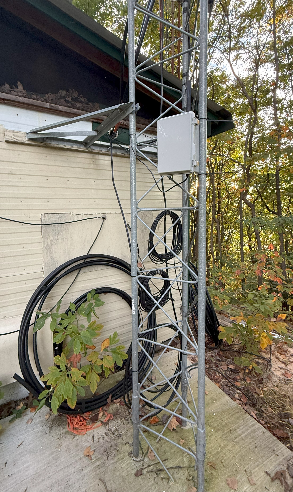
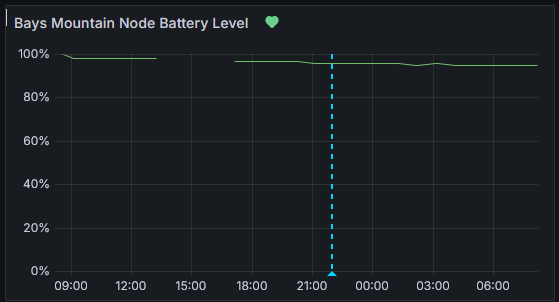
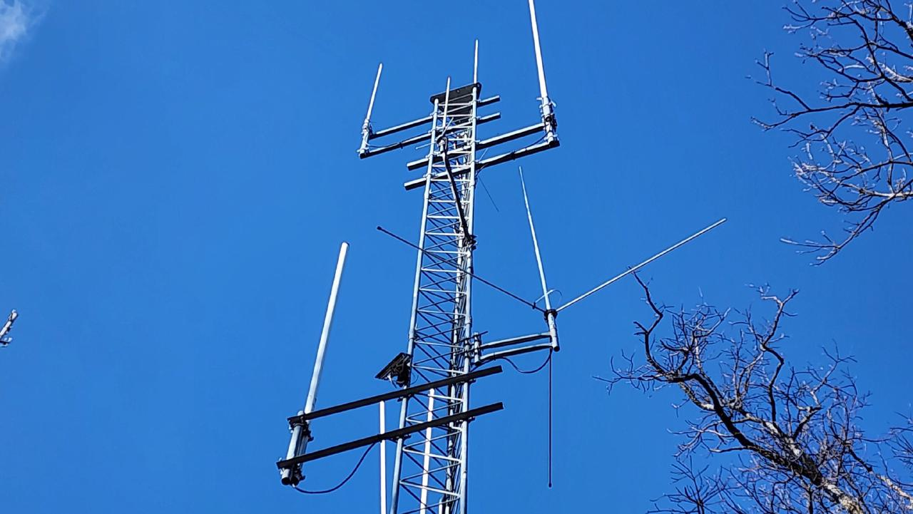

Part of the Kingsport Amateur Radio Club repeater site.

## Current Iteration (as of 10/6/2025)

The node was reinstalled on 10/6/2025 with a new RAK node and enclosure with a 900MHz cavity filter to try and mitigate the noise and issues the node has been having with reception. 

We are going to redo the mounting and try and mount the node 3' off of the tower to see if that helps because currently it is still not working. It will transmit all day long but not receive anything.

## Summer of research and trials - March-August 2025

During the summer we tried a few different nodes and had no luck with this. We did realize that we could take a node out to the corner of Bays Mountain and it would work, so we knew there was something up with the location by our tower. We spent some time doing research on new equipment and possible other locations.

## Testing the node - February 2025

Into February 2025 we were testing the node and came to the conclusion that it was working and sending its telemetry properly but was not responding to messages. We tracked it for a few weeks to check and see if it would work but it did not.

We were able to see data from it, just not control it or relay messages through it. 

## Joshua removed node - January 2025

The node was removed from the tower in January and I took it home to diagnose the problems. The diagnosis was that the battery had died before it was installed on the tower and the RAK node does not have a watchdog feature that will turn it back on when the battery gets power again. The node was reset so we had full control over it and reinstalled. 

## Original Installation - July 2024

The original node was installed in July/August of 2024 and was not working when installed. 