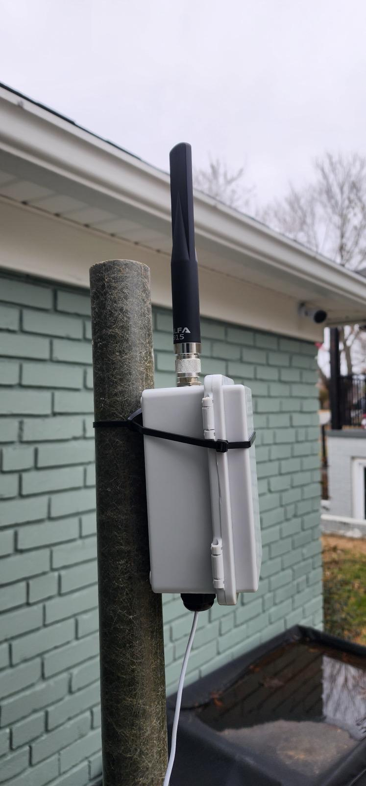

Maintained by Joshua Carmack. Used for mapping purposes, runs this site plus multiple telemetry monitors.

View some of the telemetry at [https://tricitiesmesh.net/map](https://tricitiesmesh.net/map). This shows a live view of any node that can be heard from downtown Kingsport.

## Node Setup

The node is a Heltec V3 that is on a pole on my roof. It is powered with a PoE splitter so I can run simple CAT5E cable up to it for power. It is in a cheap NEMA enclosure with an external ALFA antenna.

## Software

For the software portion, I have a Windows virtual machine running on my home server that has [MeshSense by Affirmatech](https://affirmatech.com/meshsense) installed. The node is connected to my Wi-Fi so the server is able to connect to it that way. I can then expose this software through my reverse proxy so anyone can visit [https://meshtastic.n4jhc.com/](https://meshtastic.n4jhc.com/) and view the interface of the application.

This was the first thing I set up and has proven to be an invaluable tool for testing and experimenting with nodes.